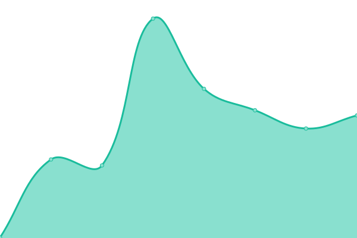
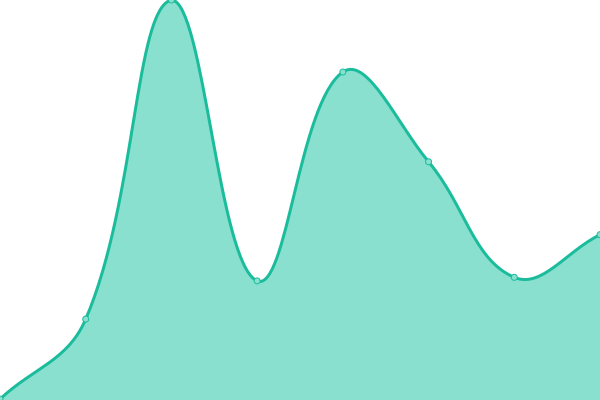
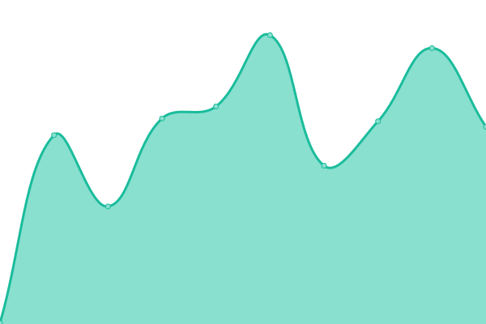
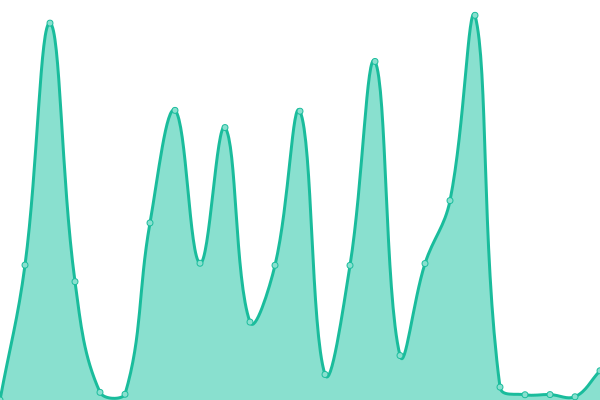
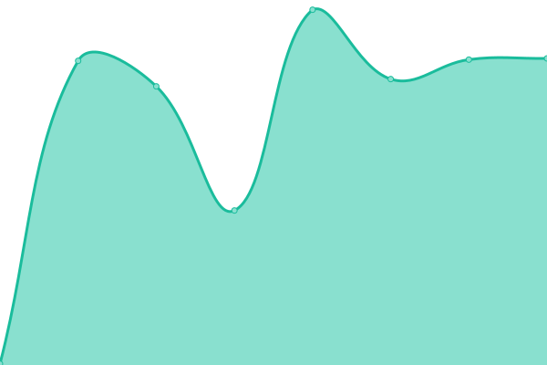
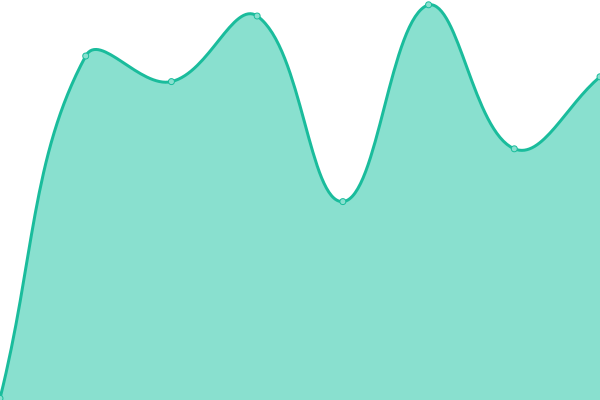
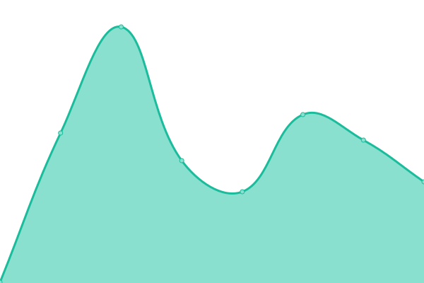
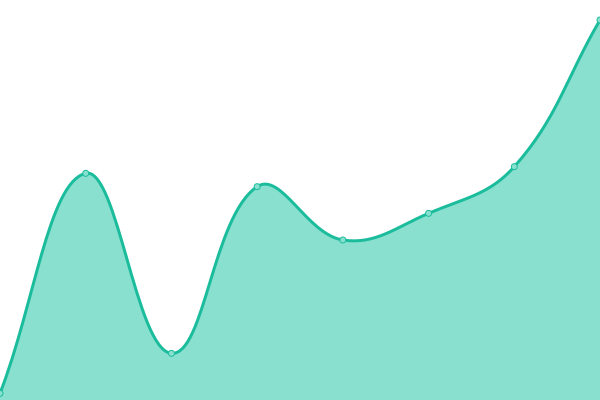
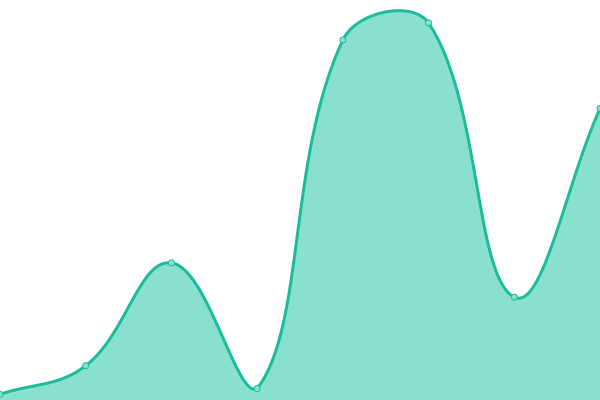
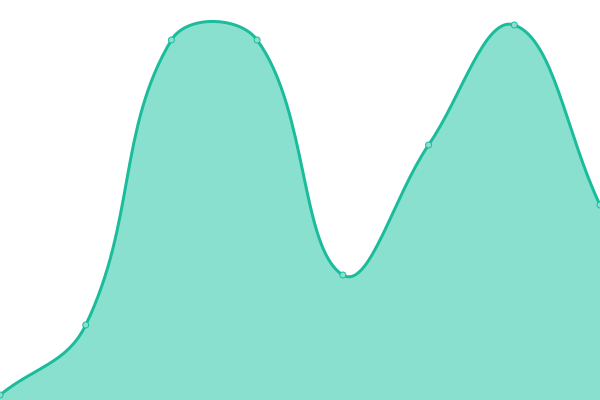

# [📈 Live Status](https://status.mewccrypto.com): <!--live status--> **🟧 Partial outage**

This repository contains the open-source uptime monitor and status page for [meowcoin-foundation](https://www.mewccrypto.com/), powered by [Upptime](https://github.com/upptime/upptime).

With [Upptime](https://upptime.js.org), you can get your own unlimited and free uptime monitor and status page, powered entirely by a GitHub repository. We use [Issues](https://github.com/meowcoin-foundation/meowcoin-status/issues) as incident reports, [Actions](https://github.com/meowcoin-foundation/meowcoin-status/actions) as uptime monitors, and [Pages](https://status.mewccrypto.com) for the status page.

<!--start: status pages-->
<!-- This summary is generated by Upptime (https://github.com/upptime/upptime) -->
<!-- Do not edit this manually, your changes will be overwritten -->
<!-- prettier-ignore -->
| URL | Status | History | Response Time | Uptime |
| --- | ------ | ------- | ------------- | ------ |
|  [Meowcoin API](https://api.mewccrypto.com/health) | 🟩 Up | [meowcoin-api.yml](https://github.com/Meowcoin-Foundation/meowcoin-status/commits/HEAD/history/meowcoin-api.yml) | 

 279ms
     
 | 

<a href="https://status.mewccrypto.com/history/meowcoin-api">100.00%</a>
    

|  [Meowcoin Explorer (Primary)](https://explorer.mewccrypto.com) | 🟩 Up | [meowcoin-explorer-primary.yml](https://github.com/Meowcoin-Foundation/meowcoin-status/commits/HEAD/history/meowcoin-explorer-primary.yml) | 

 230ms
     
 | 

<a href="https://status.mewccrypto.com/history/meowcoin-explorer-primary">100.00%</a>
    

|  [Meowcoin Explorer (Fallback)](https://explorer2.mewccrypto.com) | 🟥 Down | [meowcoin-explorer-fallback.yml](https://github.com/Meowcoin-Foundation/meowcoin-status/commits/HEAD/history/meowcoin-explorer-fallback.yml) | 

 243ms
     
 | 

<a href="https://status.mewccrypto.com/history/meowcoin-explorer-fallback">99.99%</a>
    

|  [Blockbook Server](https://blockbook.mewccrypto.com) | 🟥 Down | [blockbook-server.yml](https://github.com/Meowcoin-Foundation/meowcoin-status/commits/HEAD/history/blockbook-server.yml) | 

 3973ms
     
 | 

<a href="https://status.mewccrypto.com/history/blockbook-server">99.82%</a>
    

|  [Meowcoin RPC (Proxy)](https://mewc-rpc-mainnet.mewccrypto.com) | 🟥 Down | [meowcoin-rpc-proxy.yml](https://github.com/Meowcoin-Foundation/meowcoin-status/commits/HEAD/history/meowcoin-rpc-proxy.yml) | 

 220ms
     
 | 

<a href="https://status.mewccrypto.com/history/meowcoin-rpc-proxy">99.99%</a>
    

|  [Burn Explorer](https://burn.mewccrypto.com) | 🟩 Up | [burn-explorer.yml](https://github.com/Meowcoin-Foundation/meowcoin-status/commits/HEAD/history/burn-explorer.yml) | 

 342ms
     
 | 

<a href="https://status.mewccrypto.com/history/burn-explorer">100.00%</a>
    

|  [PawPledge Donation Platform](https://pawpledge.mewccrypto.com) | 🟩 Up | [paw-pledge-donation-platform.yml](https://github.com/Meowcoin-Foundation/meowcoin-status/commits/HEAD/history/paw-pledge-donation-platform.yml) | 

 262ms
     
 | 

<a href="https://status.mewccrypto.com/history/paw-pledge-donation-platform">100.00%</a>
    

|  [ElectrumX - meowcoinelectrum.xyz](meowcoinelectrum.xyz) | 🟥 Down | [electrum-x-meowcoinelectrum-xyz.yml](https://github.com/Meowcoin-Foundation/meowcoin-status/commits/HEAD/history/electrum-x-meowcoinelectrum-xyz.yml) | 

 30ms
     
 | 

<a href="https://status.mewccrypto.com/history/electrum-x-meowcoinelectrum-xyz">100.00%</a>
    

|  [ElectrumX - electrum.mewccrypto.com](electrum.mewccrypto.com) | 🟩 Up | [electrum-x-electrum-mewccrypto-com.yml](https://github.com/Meowcoin-Foundation/meowcoin-status/commits/HEAD/history/electrum-x-electrum-mewccrypto-com.yml) | 

 28ms
     
 | 

<a href="https://status.mewccrypto.com/history/electrum-x-electrum-mewccrypto-com">100.00%</a>
    

|  [ElectrumX - Topper](meowelectrum2.testtopper.biz) | 🟩 Up | [electrum-x-topper.yml](https://github.com/Meowcoin-Foundation/meowcoin-status/commits/HEAD/history/electrum-x-topper.yml) | 

 39ms
     
 | 

<a href="https://status.mewccrypto.com/history/electrum-x-topper">100.00%</a>
    

<!--end: status pages-->

[**Visit our status website →**](https://status.mewccrypto.com)

## 📄 License

- Powered by: [Upptime](https://github.com/upptime/upptime)
- Code: [MIT](./LICENSE) © [Anand Chowdhary](https://anandchowdhary.com), supported by [Pabio](https://pabio.com)
- Data in the `./history` directory: [Open Database License](https://opendatacommons.org/licenses/odbl/1-0/)
