# [📈 Live Status](https://status.mewccrypto.com): <!--live status--> **🟩 All systems operational**

This repository contains the open-source uptime monitor and status page for [meowcoin-foundation](https://www.mewccrypto.com/), powered by [Upptime](https://github.com/upptime/upptime).

With [Upptime](https://upptime.js.org), you can get your own unlimited and free uptime monitor and status page, powered entirely by a GitHub repository. We use [Issues](https://github.com/meowcoin-foundation/meowcoin-status/issues) as incident reports, [Actions](https://github.com/meowcoin-foundation/meowcoin-status/actions) as uptime monitors, and [Pages](https://status.mewccrypto.com) for the status page.

<!--start: status pages-->
<!-- This summary is generated by Upptime (https://github.com/upptime/upptime) -->
<!-- Do not edit this manually, your changes will be overwritten -->
<!-- prettier-ignore -->
| URL | Status | History | Response Time | Uptime |
| --- | ------ | ------- | ------------- | ------ |
|  [Meowcoin API](https://api.mewccrypto.com/health) | 🟩 Up | [meowcoin-api.yml](https://github.com/Meowcoin-Foundation/meowcoin-status/commits/HEAD/history/meowcoin-api.yml) | 

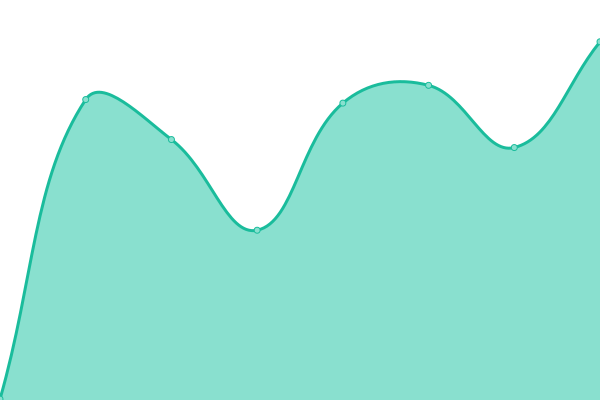 321ms
     
 | 

<a href="https://status.mewccrypto.com/history/meowcoin-api">100.00%</a>
    

|  [Meowcoin Explorer (Primary)](https://explorer.mewccrypto.com) | 🟩 Up | [meowcoin-explorer-primary.yml](https://github.com/Meowcoin-Foundation/meowcoin-status/commits/HEAD/history/meowcoin-explorer-primary.yml) | 

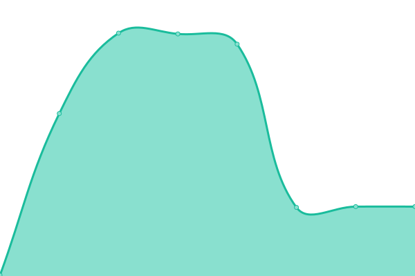 235ms
     
 | 

<a href="https://status.mewccrypto.com/history/meowcoin-explorer-primary">100.00%</a>
    

|  [Meowcoin Explorer (Fallback)](https://explorer2.mewccrypto.com) | 🟩 Up | [meowcoin-explorer-fallback.yml](https://github.com/Meowcoin-Foundation/meowcoin-status/commits/HEAD/history/meowcoin-explorer-fallback.yml) | 

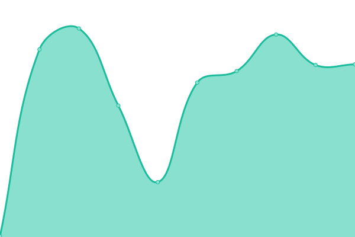 228ms
     
 | 

<a href="https://status.mewccrypto.com/history/meowcoin-explorer-fallback">99.74%</a>
    

|  [Burn Explorer](https://burn.mewccrypto.com) | 🟩 Up | [burn-explorer.yml](https://github.com/Meowcoin-Foundation/meowcoin-status/commits/HEAD/history/burn-explorer.yml) | 

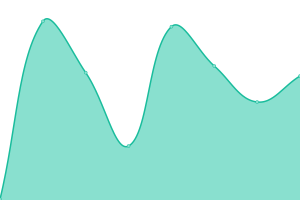 231ms
     
 | 

<a href="https://status.mewccrypto.com/history/burn-explorer">100.00%</a>
    

|  [PawPledge Donation Platform](https://pawpledge.mewccrypto.com) | 🟩 Up | [paw-pledge-donation-platform.yml](https://github.com/Meowcoin-Foundation/meowcoin-status/commits/HEAD/history/paw-pledge-donation-platform.yml) | 

 253ms
     
 | 

<a href="https://status.mewccrypto.com/history/paw-pledge-donation-platform">100.00%</a>
    

|  [electrs.mewccrypto.com (SSL)](electrs.mewccrypto.com) | 🟩 Up | [electrs-mewccrypto-com-ssl.yml](https://github.com/Meowcoin-Foundation/meowcoin-status/commits/HEAD/history/electrs-mewccrypto-com-ssl.yml) | 

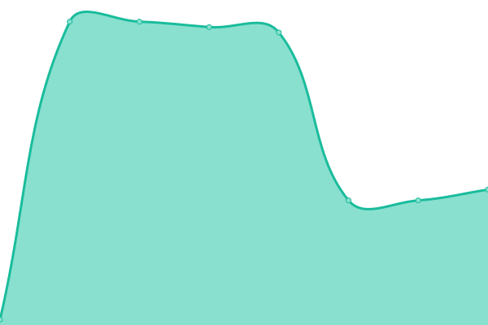 40ms
     
 | 

<a href="https://status.mewccrypto.com/history/electrs-mewccrypto-com-ssl">100.00%</a>
    

|  [electrs.mewccrypto.com (WebSocket)](electrs.mewccrypto.com) | 🟩 Up | [electrs-mewccrypto-com-web-socket.yml](https://github.com/Meowcoin-Foundation/meowcoin-status/commits/HEAD/history/electrs-mewccrypto-com-web-socket.yml) | 

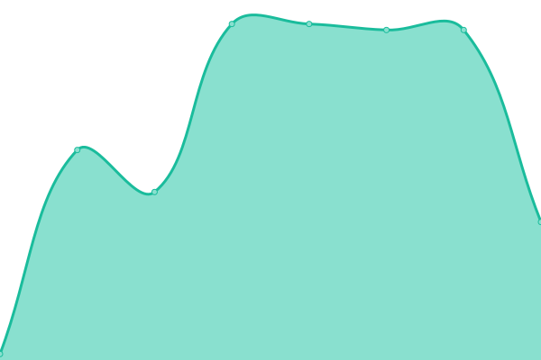 40ms
     
 | 

<a href="https://status.mewccrypto.com/history/electrs-mewccrypto-com-web-socket">100.00%</a>
    

|  [electrs2.mewccrypto.com (SSL)](electrs2.mewccrypto.com) | 🟩 Up | [electrs2-mewccrypto-com-ssl.yml](https://github.com/Meowcoin-Foundation/meowcoin-status/commits/HEAD/history/electrs2-mewccrypto-com-ssl.yml) | 

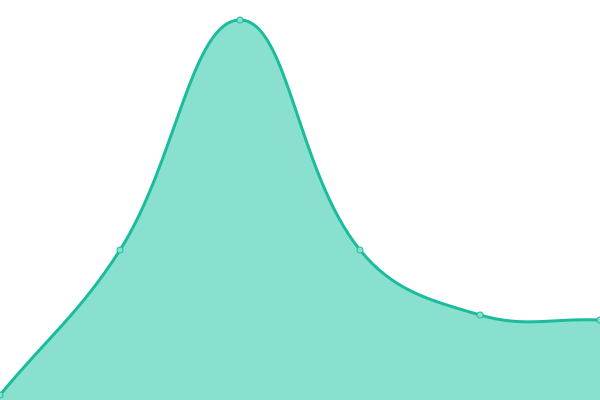 45ms
     
 | 

<a href="https://status.mewccrypto.com/history/electrs2-mewccrypto-com-ssl">100.00%</a>
    

|  [electrs2.mewccrypto.com (WebSocket)](electrs2.mewccrypto.com) | 🟩 Up | [electrs2-mewccrypto-com-web-socket.yml](https://github.com/Meowcoin-Foundation/meowcoin-status/commits/HEAD/history/electrs2-mewccrypto-com-web-socket.yml) | 

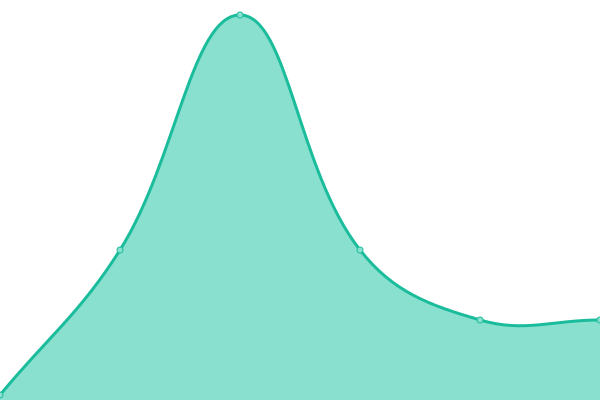 46ms
     
 | 

<a href="https://status.mewccrypto.com/history/electrs2-mewccrypto-com-web-socket">100.00%</a>
    

|  [electrs3.meowcoin.org (SSL)](electrs3.meowcoin.org) | 🟩 Up | [electrs3-meowcoin-org-ssl.yml](https://github.com/Meowcoin-Foundation/meowcoin-status/commits/HEAD/history/electrs3-meowcoin-org-ssl.yml) | 

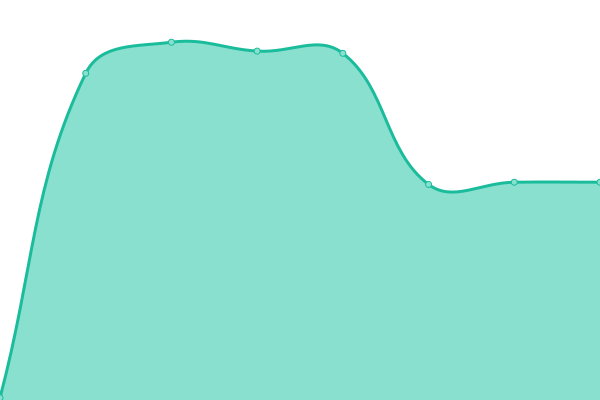 126ms
     
 | 

<a href="https://status.mewccrypto.com/history/electrs3-meowcoin-org-ssl">100.00%</a>
    

|  [electrs3.meowcoin.org (WebSocket)](electrs3.meowcoin.org) | 🟩 Up | [electrs3-meowcoin-org-web-socket.yml](https://github.com/Meowcoin-Foundation/meowcoin-status/commits/HEAD/history/electrs3-meowcoin-org-web-socket.yml) | 

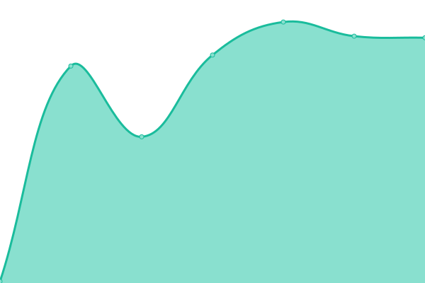 125ms
     
 | 

<a href="https://status.mewccrypto.com/history/electrs3-meowcoin-org-web-socket">100.00%</a>
    

|  [electrs4.meowcoin.org (SSL)](electrs4.meowcoin.org) | 🟩 Up | [electrs4-meowcoin-org-ssl.yml](https://github.com/Meowcoin-Foundation/meowcoin-status/commits/HEAD/history/electrs4-meowcoin-org-ssl.yml) | 

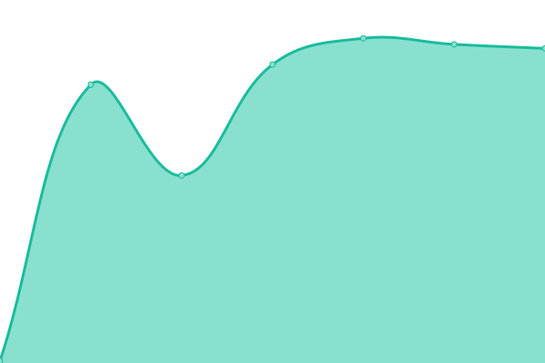 126ms
     
 | 

<a href="https://status.mewccrypto.com/history/electrs4-meowcoin-org-ssl">100.00%</a>
    

|  [electrs4.meowcoin.org (WebSocket)](electrs4.meowcoin.org) | 🟩 Up | [electrs4-meowcoin-org-web-socket.yml](https://github.com/Meowcoin-Foundation/meowcoin-status/commits/HEAD/history/electrs4-meowcoin-org-web-socket.yml) | 

 126ms
     
 | 

<a href="https://status.mewccrypto.com/history/electrs4-meowcoin-org-web-socket">100.00%</a>
    

<!--end: status pages-->

[**Visit our status website →**](https://status.mewccrypto.com)

## 📄 License

- Powered by: [Upptime](https://github.com/upptime/upptime)
- Code: [MIT](./LICENSE) © [Anand Chowdhary](https://anandchowdhary.com), supported by [Pabio](https://pabio.com)
- Data in the `./history` directory: [Open Database License](https://opendatacommons.org/licenses/odbl/1-0/)
